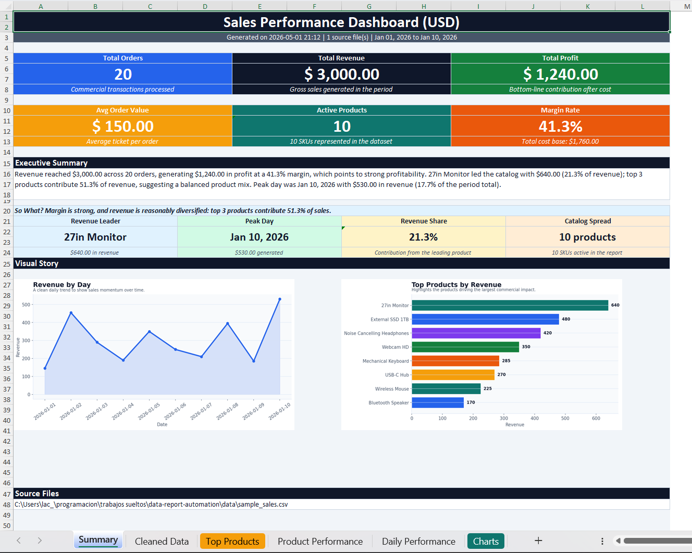
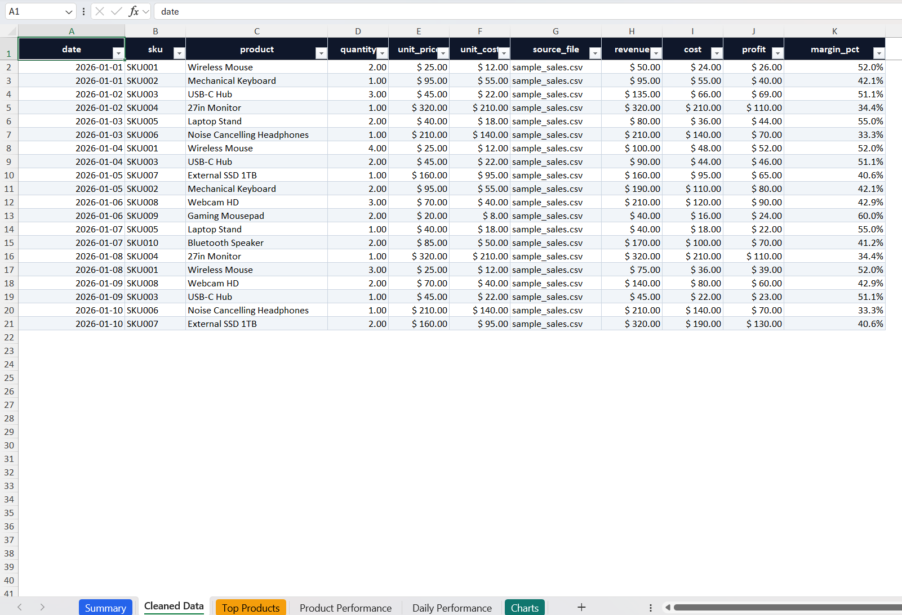
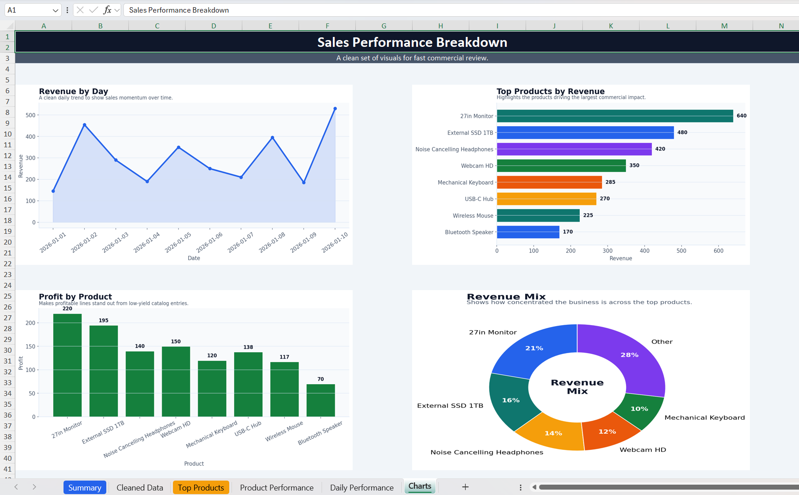
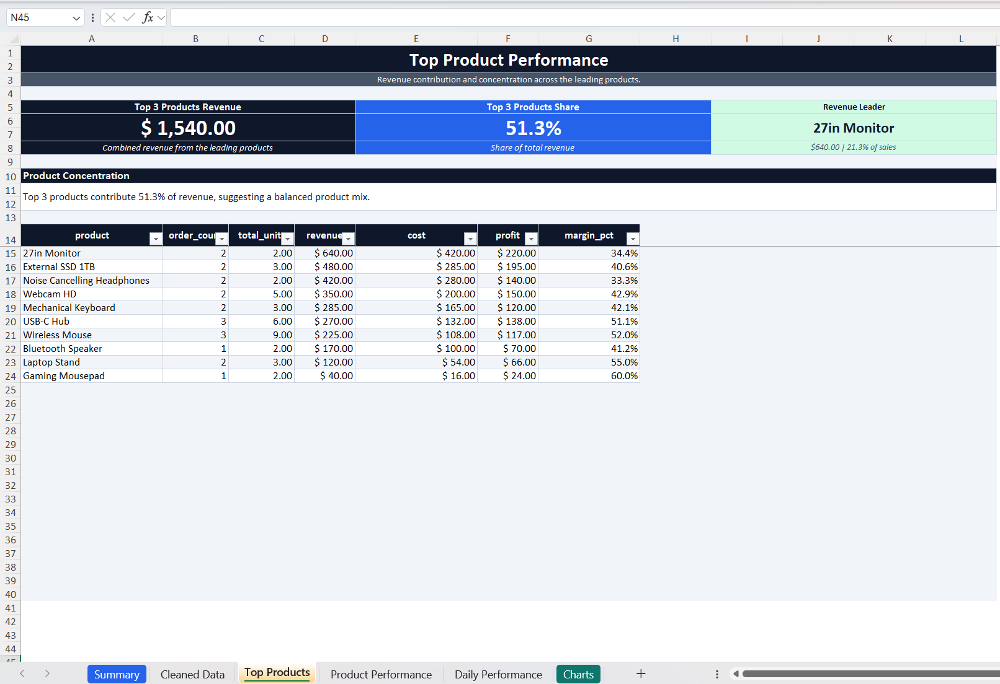

# 📊 Data Report Automation

> Python CLI tool that transforms raw sales files (CSV/XLSX) into a polished Excel dashboard with business KPIs, analysis sheets, and presentation-ready charts.

[](https://www.python.org/downloads/)
[](LICENSE)
[](#tests)

---

## Overview

This project automates a full reporting workflow:

1. Load one CSV/XLSX file or a full folder of files
2. Normalize source columns using configurable aliases
3. Clean and validate sales records
4. Compute business KPIs and performance breakdowns
5. Generate charts and export a polished Excel workbook

The goal is not to produce a plain spreadsheet dump. The generated workbook is designed to feel like a compact business reporting tool.

## Reporting Highlights

- Executive Summary with revenue, orders, profit, margin, top-product contribution, and peak-day performance
- "So What?" insight on the Summary sheet that translates metrics into a short business takeaway
- Top Products sheet with top 3 revenue, top 3 revenue share, and product concentration commentary
- Sales Performance Breakdown sheet with embedded charts for fast visual review
- Cleaned Data, Product Performance, and Daily Performance sheets for audit and analysis

## Quick Start

```bash
git clone https://github.com/Lautarocuello98/data-report-automation.git
cd data-report-automation
pip install -r requirements.txt
python cli.py --input data/sample_sales.csv --output reports
```

## Example

### Input

Example source dataset:


### Generated Workbook Preview

The screenshots below show the current output style of the generated Excel report.

| Executive Summary | Top Products |
| --- | --- |
|  |  |

| Daily Performance | Sales Performance Breakdown |
| --- | --- |
|  |  |

## Workbook Output

The generated `sales_report.xlsx` includes these sheets:

| Sheet | Purpose |
| --- | --- |
| `Summary` | KPI dashboard with executive summary, "So What?" insight, and embedded visuals |
| `Cleaned Data` | Normalized dataset with calculated revenue, cost, profit, and margin fields |
| `Top Products` | Top 3 revenue metrics, revenue-share insight, and ranked leading products |
| `Product Performance` | Full product-level performance table |
| `Daily Performance` | Day-by-day orders, revenue, profit, and margin view |
| `Charts` | Sales Performance Breakdown gallery with generated charts |

Generated chart assets:

- `revenue_by_day.png`
- `top_products.png`
- `profit_by_product.png`
- `revenue_mix.png`

## Features

| Feature | Description |
| --- | --- |
| Multi-file ingestion | Process one file or a folder of files |
| Configurable mapping | Match alternate column names through `config.json` |
| Data cleaning | Remove duplicates, coerce numeric fields, and standardize strings |
| KPI engine | Revenue, cost, profit, margin, average order value, top products, and peak day |
| Business commentary | Short narrative summaries generated from the actual data |
| Excel dashboard | Multi-sheet workbook with styled cards, insights, and tables |
| Chart export | Styled PNG charts embedded into the workbook |
| Logging | Processing trace written to `reports/processing.log` |
| Tests | Regression coverage with `pytest` |

## Usage

Run against a single file:

```bash
python cli.py --input data/sample_sales.csv --output reports
```

Run against a folder:

```bash
python cli.py --input data --output reports
```

Optional flags:

```text
--config config.json
--verbose
```

## Output Files

Expected output structure:

```text
reports/
|-- sales_report.xlsx
|-- processing.log
`-- charts/
    |-- revenue_by_day.png
    |-- top_products.png
    |-- profit_by_product.png
    `-- revenue_mix.png
```

## Architecture

Execution pipeline:

```text
cli.py
  -> src/loader.py
  -> src/cleaner.py
  -> src/processor.py
  -> src/charts.py
  -> src/report_generator.py
```

Module responsibilities:

- `cli.py`: parses CLI args, loads config, orchestrates the pipeline, and writes logs
- `src/loader.py`: loads CSV/XLSX files and applies column mapping
- `src/cleaner.py`: validates and normalizes the dataset
- `src/processor.py`: computes KPIs and summary tables
- `src/charts.py`: creates PNG chart assets
- `src/report_generator.py`: builds the Excel workbook layout and styling

## Project Structure

```text
data-report-automation/
|-- cli.py
|-- config.json
|-- requirements.txt
|-- README.md
|-- LICENSE
|-- data/
|-- images/
|-- reports/
|-- src/
`-- tests/
```

## Tests

Run the test suite with:

```bash
python -m pytest -v
```

## Tech Stack

- Python
- pandas
- openpyxl
- matplotlib
- pytest

## License

This project is licensed under the MIT License. See [LICENSE](LICENSE).

## Author

Lautaro Cuello  
GitHub: https://github.com/Lautarocuello98

---

⭐ If you found this project useful, consider giving the repository a star.
