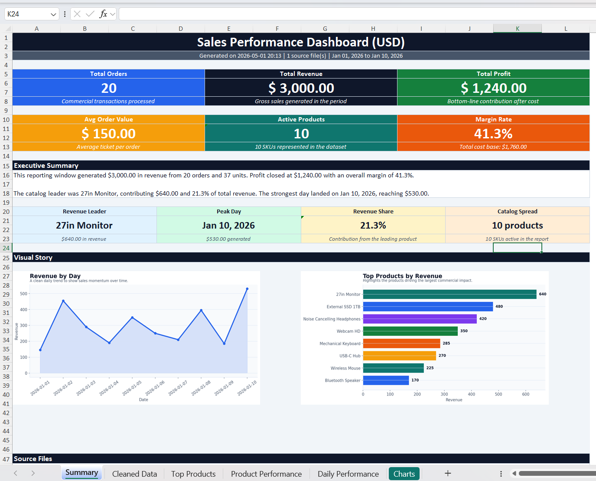
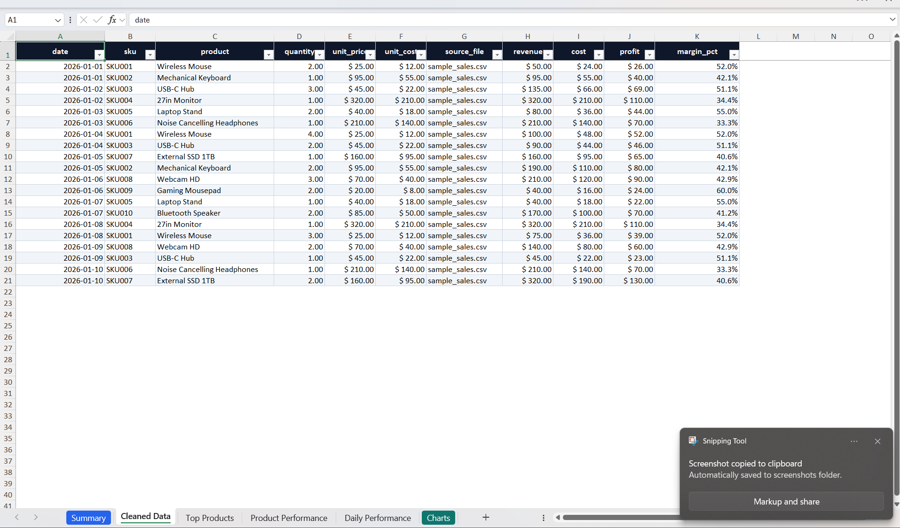
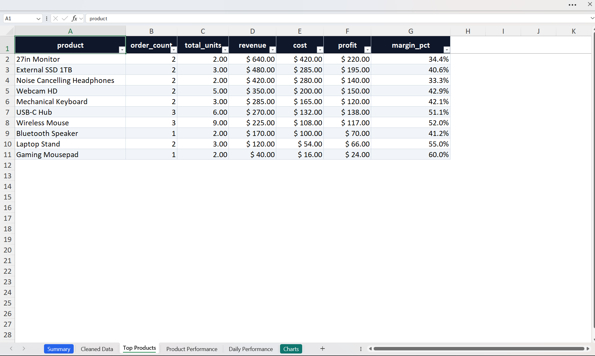
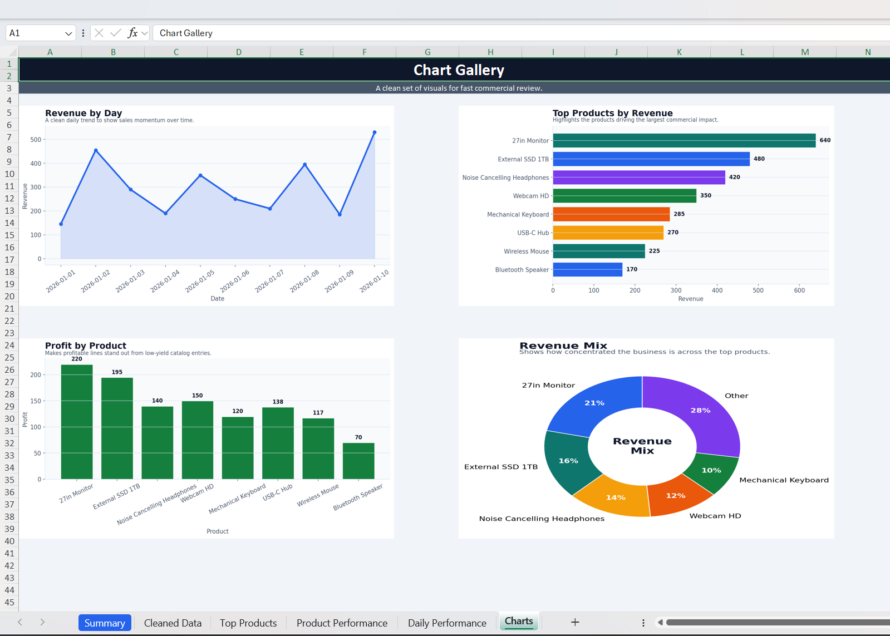

# Data Report Automation

> Python CLI tool that transforms raw sales files (CSV/XLSX) into a polished Excel dashboard with business KPIs, analysis sheets, and presentation-ready charts.

[](https://www.python.org/downloads/)
[](LICENSE)
[](#tests)

---

## Overview

This project automates a complete reporting workflow:

1. Load one file or a full folder of source files
2. Normalize columns and clean records
3. Compute business KPIs and performance breakdowns
4. Generate branded visual charts
5. Export everything to a portfolio-ready Excel workbook

The final deliverable is no longer just a spreadsheet dump. It is a structured reporting asset with:

- A dashboard-style summary sheet
- KPI cards and executive summary text
- Product and daily performance breakdowns
- A dedicated chart gallery
- Cleaned data ready for audit or handoff

---

## Quick Start

```bash
git clone https://github.com/Lautarocuello98/data-report-automation.git
cd data-report-automation
pip install -r requirements.txt
python cli.py --input data/sample_sales.csv --output reports
```

---

## Example

### Input

Example dataset used as source input.


---

### Final Excel Preview

The generated workbook now includes a stronger visual presentation across the summary, analysis sheets, and chart gallery.

| Dashboard Summary | Product Analysis |
| --- | --- |
|  |  |

| Daily Performance | Chart Gallery |
| --- | --- |
|  |  |

---

## Features

| Feature | Description |
| --- | --- |
| Multi-file ingestion | Process a single file or an entire folder |
| Data cleaning | Normalize values, remove duplicates, validate records |
| KPI engine | Revenue, cost, profit, margin, average order value, top performers |
| Executive summary | Auto-generated business summary in the main dashboard |
| Multi-sheet Excel output | Summary, cleaned data, top products, product performance, daily performance, charts |
| Visual storytelling | Embedded charts and gallery-ready reporting visuals |
| Logging | Full processing log in `processing.log` |
| Tests | Automated coverage with `pytest` |

---

## Workbook Output

The generated Excel report includes these sheets:

| Sheet | Purpose |
| --- | --- |
| `Summary` | Dashboard cover with KPI cards, executive summary, insights, and embedded visuals |
| `Cleaned Data` | Final normalized dataset with calculated columns |
| `Top Products` | Top-performing products ranked by revenue |
| `Product Performance` | Full product-level business breakdown |
| `Daily Performance` | Day-by-day sales and profitability view |
| `Charts` | Dedicated gallery of generated charts |

Generated chart assets:

- `revenue_by_day.png`
- `top_products.png`
- `profit_by_product.png`
- `revenue_mix.png`

---

## Architecture

Execution pipeline:

```text
cli.py
  -> src/loader.py           (load and merge input files)
  -> src/cleaner.py          (validate and normalize data)
  -> src/processor.py        (compute KPIs and performance tables)
  -> src/charts.py           (generate styled chart assets)
  -> src/report_generator.py (build the Excel dashboard workbook)
```

Module responsibilities:

**cli.py**

- CLI argument parsing
- config loading
- orchestration
- logging setup

**loader.py**

- loads CSV/XLSX files
- merges datasets
- applies column mapping
- tracks source files

**cleaner.py**

- validates required columns
- removes duplicates
- handles missing values
- normalizes fields

**processor.py**

- computes totals and core business KPIs
- builds product and daily performance tables
- prepares summary metrics used by the dashboard

**charts.py**

- generates styled visual assets for the workbook

**report_generator.py**

- creates the final Excel report
- builds the dashboard layout and analysis sheets

---

## Project Structure

```text
data-report-automation/
|
|-- cli.py
|-- config.json
|-- requirements.txt
|-- README.md
|-- LICENSE
|
|-- data/
|   |-- sample_sales.csv
|
|-- src/
|   |-- loader.py
|   |-- cleaner.py
|   |-- processor.py
|   |-- charts.py
|   `-- report_generator.py
|
|-- tests/
|   |-- conftest.py
|   |-- test_loader.py
|   |-- test_cleaner.py
|   |-- test_processor.py
|   |-- test_charts.py
|   `-- test_report_generator.py
|
|-- images/
|   |-- csv_input.png
|   |-- example_excel_1.png
|   |-- example_excel_2.png
|   |-- example_excel_3.png
|   `-- example_excel_4.png
|
`-- reports/                # generated outputs
```

---

## Installation

### Requirements

- Python `3.10+`
- `pip`

### Setup

```bash
git clone https://github.com/Lautarocuello98/data-report-automation.git
cd data-report-automation
pip install -r requirements.txt
```

---

## Usage

Run against a folder:

```bash
python cli.py --input data --output reports
```

Run against a single file:

```bash
python cli.py --input data/sample_sales.csv --output reports
```

Optional flags:

```text
--config config.json
--verbose
```

Expected outputs:

```text
reports/
|
|-- sales_report.xlsx
|-- processing.log
|
`-- charts/
    |-- revenue_by_day.png
    |-- top_products.png
    |-- profit_by_product.png
    `-- revenue_mix.png
```

---

## Tests

Run the automated test suite:

```bash
python -m pytest -v
```

---

## Tech Stack

- Python
- pandas
- openpyxl
- matplotlib
- pytest

---

## License

This project is licensed under the **MIT License**.

See [LICENSE](LICENSE) for details.

---

## Author

Lautaro Cuello

GitHub
https://github.com/Lautarocuello98
